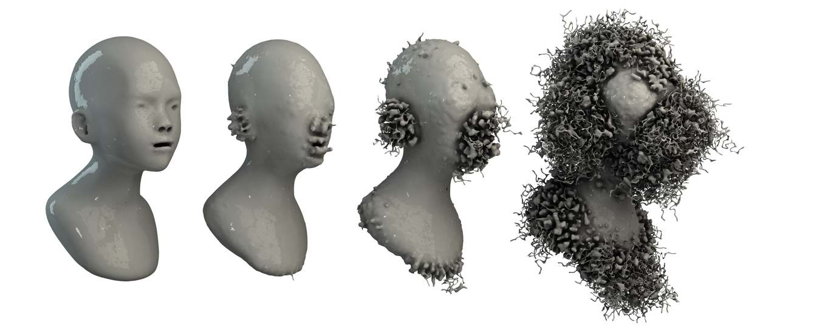

### WORK IN PROGRESS -- currently under revision

# DIGITAL MORPHOLOGIES: Environmentally-Influenced Generative Forms

We present a generative method to grow triangular meshes with organically-shaped features. Through the application of simplified forces, millions of particles develop into complex 3D forms in silico. These forms interact with external environments in a variety of ways, allowing for the integration of the proposed technique with pre-existing 3D objects and scenes. Large simulation sizes were computationally achieved through the massively parallel capabilities of modern Graphics Processing Units (GPUs).

More info [here](http://sagejenson.com/digital-morphologies).

### Implementation

Using C++. Tested on OSX.

### Dependencies

* Eigen3 for Vector3D
* libigl for viewer

### Sample Output

